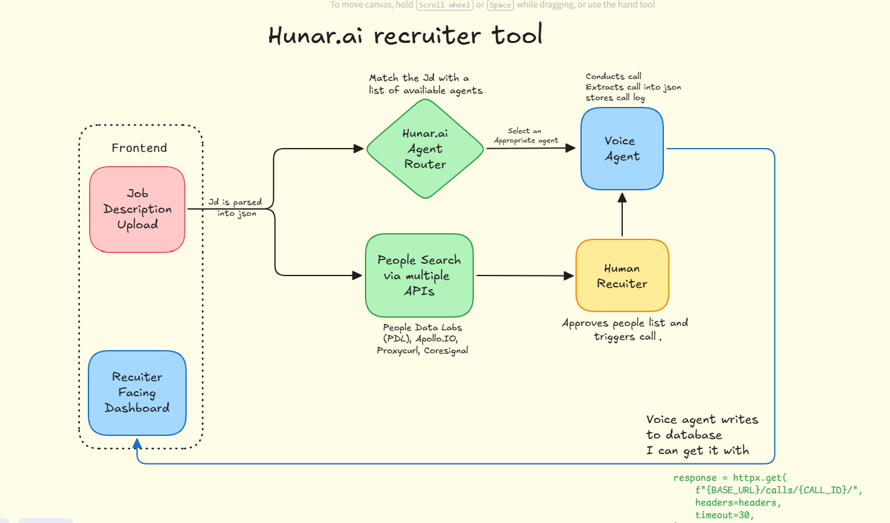

# Hunar Recruiter Platform

An AI-assisted recruiting workspace that turns an unstructured job description into a structured role, ranked candidates, recruiter approvals, and voice-screening results.

Built as an integration-focused Forward Deployed Engineer assignment, the platform demonstrates a complete recruiter workflow while keeping human approval in the loop before candidate outreach.



## What It Does

Hunar Recruiter Platform helps a recruiter move through five connected stages:

1. **Understand the role**: upload a TXT, PDF, or DOCX job description and extract structured requirements.
2. **Find candidates**: source demo or PDL candidates, normalize their records, and rank them against the role.
3. **Route the work**: select the most appropriate Hunar voice agent from the local agent registry.
4. **Review and approve**: inspect ranked candidates and explicitly approve who can be contacted.
5. **Screen and evaluate**: start voice screenings, synchronize call status, and review results in the dashboard.

## End-to-End Architecture

```text
Recruiter
    |
    v
Next.js dashboard
    |
    | multipart upload / JSON requests
    v
FastAPI application
    |
    +--> Document extraction and text normalization
    |        |
    |        v
    |    OpenAI structured JD parser
    |        |
    |        v
    |    JobDescription schema
    |
    +--> Candidate sourcing
    |        |
    |        +--> Demo candidate records
    |        +--> PDL integration
    |        |
    |        v
    |    Normalization and match scoring
    |
    +--> Hunar agent registry and routing
    |
    +--> Human approval and screening orchestration
             |
             v
        Hunar voice calls
             |
             v
      Status and results
             |
             v
        SQLite database
```

The full visual architecture is available in [`image.png`](image.png) and in the frontend's **How it works** section.

## Application Walkthrough

### 1. Upload and analyze

The Jobs view accepts `.txt`, `.pdf`, and `.docx` files. The backend extracts text and applies UTF-8 cleanup at the document boundary so normal content such as `AI Engineer`, `Adobe`, and `Bangalore, India` reaches the parser unchanged.

### 2. Review the dashboard

After analysis, the app opens the Dashboard. It summarizes:

- Parsed role and company details
- Selected Hunar agent and routing confidence
- Candidate volume and approval progress
- Screening totals and current statuses

### 3. Inspect candidates

The Candidates view displays each candidate's name, contact details, title, location, experience, match score, source, and approval status. A recruiter can select candidates and approve them before screening.

### 4. Run screenings

The Screenings view starts calls only for approved candidates with valid phone numbers. It displays call status, Hunar call identifiers, synchronization controls, recordings, transcripts, and returned results.

### 5. Understand the implementation

The How it works view explains the workflow, documents the demo tradeoffs, and displays the architecture diagram without taking space away from the upload experience.

## Demo Scope and Tradeoffs

This repository is designed to be runnable for evaluation without requiring every paid production integration.

### People Data Labs

People Data Labs search requires a paid Pro plan for the production API access used by this workflow. The demo therefore defaults to local candidate records in [`data/demo_candidates.json`](data/demo_candidates.json). This is an intentional substitution, not a change to the workflow: sourcing, normalization, matching, approval, and screening orchestration remain represented end to end.

The PDL client and normalization boundary remain in place for a production account. Set `CANDIDATE_SOURCE=pdl` or `CANDIDATE_SOURCE=hybrid` when the required access is available.

### Hunar voice screening

Live voice calls require Hunar credentials and an accessible Hunar environment. Without those credentials, the rest of the workflow can still be demonstrated with local candidate data and the dashboard.

## Technology

### Backend

- Python 3.13+
- FastAPI and Uvicorn
- OpenAI structured parsing
- Pydantic models
- SQLAlchemy with SQLite
- `pypdf` for PDF extraction
- `python-docx` for DOCX extraction
- `ftfy` for text normalization

### Frontend

- Next.js 16 App Router
- React 19
- TypeScript
- Tailwind CSS
- Lucide icons

### Integrations

- OpenAI for structured JD extraction
- Hunar for voice-screening orchestration
- People Data Labs for optional candidate sourcing

## Repository Layout

```text
.
├── data/
│   ├── agents.json                 Hunar agent registry
│   ├── demo_candidates.json        Local demo candidate records
│   └── recruiter.db                Local SQLite database
├── frontend/
│   ├── app/page.tsx                Recruiter workspace and navigation
│   ├── app/globals.css             Global styles
│   ├── lib/api.ts                  Backend API client
│   └── public/architecture.png     Frontend architecture asset
├── src/hunar_recruiter/
│   ├── api/                        Candidate, job, and screening routes
│   ├── agent_routing/              Agent registry and selection
│   ├── integrations/               Hunar and PDL clients
│   ├── models/                     Domain and database models
│   └── services/                   Parsing, matching, screening, persistence
├── image.png                       Source architecture diagram
├── pyproject.toml                  Python dependencies and package config
├── req.txt                         Legacy dependency list
└── uv.lock                         Locked Python dependencies
```

## Requirements

- Python 3.13 or newer
- Node.js 20 or newer
- [`uv`](https://docs.astral.sh/uv/)
- OpenAI API key
- Optional Hunar API key for live calls
- Optional PDL access for live candidate sourcing

## Quick Start

### 1. Install backend dependencies

From the repository root:

```powershell
uv sync
Copy-Item .env.example .env
```

Add the required OpenAI key to `.env`:

```env
OPENAI_API_KEY=your-openai-key
CANDIDATE_SOURCE=demo
```

For live Hunar screening, add:

```env
HUNAR_API_KEY=your-hunar-key
```

Start the backend:

```powershell
uv run uvicorn hunar_recruiter.main:app --reload --port 8000
```

The API runs at `http://127.0.0.1:8000`. Interactive API documentation is available at `http://127.0.0.1:8000/docs`.

### 2. Install and start the frontend

In a second terminal:

```powershell
Set-Location frontend
npm install
```

Create `frontend/.env.local`:

```env
NEXT_PUBLIC_API_BASE_URL=http://127.0.0.1:8000
```

Start the dashboard:

```powershell
npm run dev
```

Open `http://localhost:3000` and upload a job description.

## API Reference

| Method | Endpoint | Description |
| --- | --- | --- |
| `GET` | `/health` | Check backend availability. |
| `POST` | `/jobs/parse` | Extract and parse a JD without persistence. |
| `POST` | `/jobs/analyze` | Run extraction, parsing, routing, sourcing, matching, and persistence. |
| `POST` | `/jobs/{job_id}/candidates/approve` | Approve selected candidates. |
| `POST` | `/jobs/{job_id}/screenings/start` | Start screenings for approved candidates. |
| `GET` | `/jobs/screenings/{screening_id}` | Retrieve application-side screening state. |
| `POST` | `/jobs/screenings/{screening_id}/sync` | Synchronize screening state with Hunar. |

## Configuration

`CANDIDATE_SOURCE` controls candidate sourcing:

| Value | Behavior |
| --- | --- |
| `demo` | Use local deterministic demo candidates. Recommended for evaluation. |
| `pdl` | Query People Data Labs. Requires suitable PDL access. |
| `hybrid` | Combine PDL results with local demo candidates. |

Supported uploads are `.txt`, `.pdf`, and `.docx`. Text normalization is applied once by the shared document parser and is used consistently by both `/jobs/parse` and `/jobs/analyze`.

## Development Commands

Backend compilation:

```powershell
uv run python -m compileall -q src
```

Frontend production build:

```powershell
Set-Location frontend
npm run build
```

Frontend linting:

```powershell
npm run lint
```

## Design Principles

- **Human approval before outreach**: candidate selection is explicit and visible.
- **Structured contracts**: Pydantic models align parser output, routing, matching, persistence, and API responses.
- **Integration boundaries**: Hunar and PDL clients are isolated from the core workflow.
- **Demo-friendly defaults**: local data keeps the complete product flow testable without paid services.
- **Centralized text handling**: uploaded document content is normalized before any downstream AI processing.

## Production Considerations

The current implementation is intentionally focused on the assignment workflow. A production deployment would additionally need authentication, tenant isolation, authorization, background job processing, secrets management, database migrations, retry policies, observability, rate limiting, and a durable job history experience.
